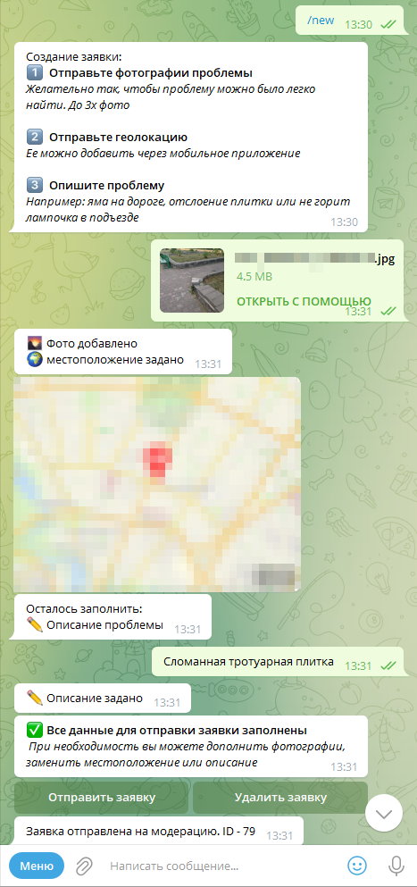
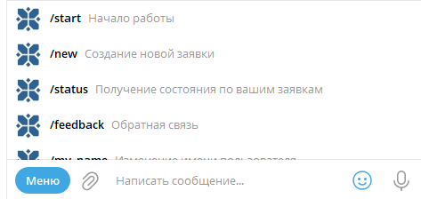
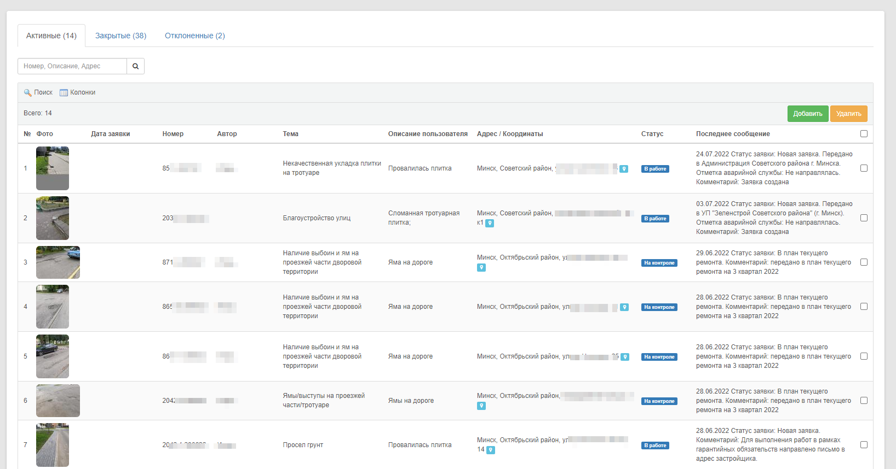
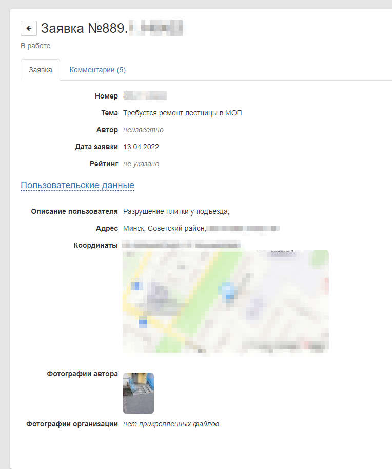
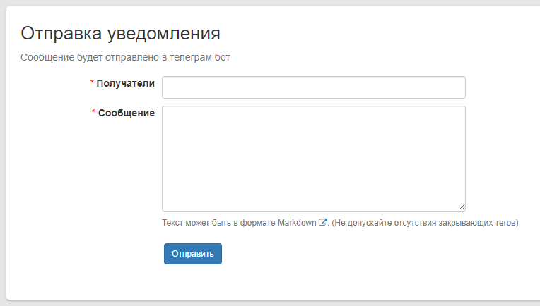

# Minsk115

Модуль для отправки заявок в 115.бел.\
Создан на базе фреймворка [Core2](https://github.com/easterism/core2)

## Функции

- Получение заявок из 115.бел
- Получение заявок из Телеграм бота 
- Модерация заявок и отправка их в 115.бел

## Примеры

Телеграм бот `@minsk115_bot`

Отправка заявки через телеграм бота\

Меню телеграмм бота\

Список заявок полученных через Tg или из 115.бел\

Модерация, просмотр заявки\

Отправка сообщения пользователям телеграмм бота\

